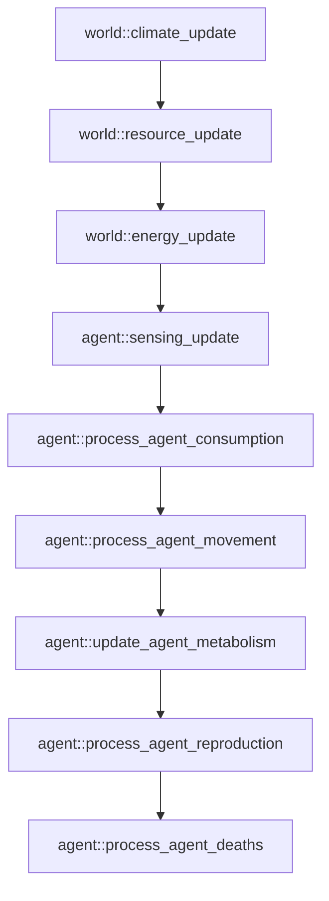

# Phase 3 Evolution Technical Specification

## Status
* **Status:** Active Specification
* **Implementation Status:** Implemented and Verified through Milestone 18 (Reproduction, Inheritance & Lineage)
* **Phase:** Phase 3 — Evolution
* **Author:** Senior Rust ECS Architect
* **Date:** 2026-06-15

---

## 1. Purpose & Vision

This technical specification details the evolution layer of Project Genesis (Phase 3). It builds upon the completed Phase 2 (autonomous life with hunger, aging, and movement) and introduces the biological pressures of heredity, genetics, mutation, and natural selection. 

In alignment with **AGENTS.md** and **PRINCIPLES.md**, we do not program evolution or hardcode fitness functions. Instead, we establish genomic representations and metabolic reproduction feedback loops that allow populations to adapt to the environmental substrate (Phase 1 terrain, climate, and resources) or perish.

---

## 2. Scope & Boundaries

### In Scope
* **Genomic Coding:** Implementing a compact, deterministic genetic array (`Genome`) attached to agent entities.
* **Phenotype Derivation:** Designing a structured mapping function from raw gene floats to physical agent traits (`Phenotype`).
* **Metabolic Trade-offs:** Creating biophysical costs balancing trait advantages (e.g., larger sensing radius or slope tolerance increases metabolic base cost).
* **Resource Consumption:** Implementing nutrient and fresh water consumption systems that deplete local chunks and replenish agent energy.
* **Deterministic Inheritance & Mutation:** Implementing asexual division with seed-stable mutation steps.
* **Population Diagnostics:** Creating telemetry structures for monitoring genetic drift and selection pressures.
* **Save/Load Compatibility:** Upgrading snapshot schemas to Version 3 to serialize agent genomes deterministically.

### Out of Scope
* **Sexual Reproduction:** Finding mates, gene crossovers, and sex-differentiated traits (deferred to Phase 4/5).
* **Hard Collisions:** Blocking agents from entering the same cell (remains out of scope; density is managed metabolically and via caps).
* **Neural Networks:** Sensory-action neural routing (deferred to Phase 5).

---

## 3. Subsystem Architecture

### 3.1 Genome & Trait Mapping

The genome is the raw information substrate. To support long-term extensibility (e.g. adding memory, decision parameters, and social traits in later phases) and preserve snapshot compatibility, the genome is modeled as an extensible vector of floating-point values in the range `[0.0, 1.0]`.

```rust
pub const GENOME_SIZE: usize = 8;

#[derive(Component, Debug, Clone, PartialEq, Serialize, Deserialize)]
pub struct Genome {
    pub genes: Vec<f32>,
}
```

#### Extensibility & Version Migration Strategy
When new genes are added in future phases, the `GENOME_SIZE` constant is incremented, and new mapping entries are added to the trait registry. Backward snapshot compatibility is preserved on load as follows:
* **Shorter Loaded Vector:** If the loaded `genes` vector is shorter than the compile-time `GENOME_SIZE`, the missing genes are appended and padded with trait-specific default values (configured in `WorldConfig`).
* **Longer Loaded Vector:** If the loaded `genes` vector is longer, the extra genes are kept or truncated depending on version flags, ensuring zero compile-time or panic failures.

### 3.1b Lineage Tracking Component
To trace agent lineages and provide foundations for kin selection, cooperative tribes, and evolution analytics, each agent entity carries a `LineageMetadata` component.

```rust
#[derive(Component, Debug, Clone, Copy, PartialEq, Eq, Serialize, Deserialize)]
pub struct LineageMetadata {
    /// Unique stable identifier of the direct parent. None for startup spawned agents.
    pub parent_id: Option<u64>,
    /// Chronological generation depth starting from 0.
    pub generation: u32,
}
```
* **Metabolic Spawning:** Startup agents are initialized with `parent_id = None` and `generation = 0`. Upon reproduction, the offspring is initialized with `parent_id = Some(parent.id)` and `generation = parent.generation + 1`.
* **Analytical/Societal Use:** Lineage tracking is read-only during system ticks, presenting zero side-effects on determinism, and maps to social hierarchies, reputation shares, and kin-based alliance metrics.

#### Gene Registry Index Mapping
Each gene index maps to a specific biological parameter, scaled linearly between a minimum and maximum phenotypic value configured in `WorldConfig`:

| Gene Index | Phenotypic Trait | Config Value Mappings | Biological Purpose |
|---|---|---|---|
| `0` | **Thermal Optimum** | `[temp_min, temp_max]` | Temperature at which metabolic decay is minimized. |
| `1` | **Diet Preference** | `[0.0 (Nutrient), 1.0 (Water)]` | Relative preference/efficiency for eating nutrients vs drinking fresh water. |
| `2` | **Max Slope Limit** | `[0.10, 0.60]` | Steepest terrain gradient the agent can step onto. |
| `3` | **Max Water Limit** | `[0.10, 0.50]` | Deepest water level the agent can traverse. |
| `4` | **Sensing Radius** | `[1, 4]` (Discrete) | Cell radius defining agent's neighborhood sensing. |
| `5` | **Reproduction Threshold** | `[150.0, 500.0]` | Energy stock needed to trigger reproduction. |
| `6` | **Maturity Age** | `[20, 200]` | Chronological age (ticks) required before reproducing. |
| `7` | **Physical Size** | `[0.5, 2.0]` | Scales resource absorption capacity and movement costs. |

---

### 3.2 Phenotype & Metabolic Trade-offs

To prevent the emergence of a "super-agent" (a phenotype maximized for all parameters), a set of metabolic trade-offs is mathematically enforced:

1. **Size-Sensing Metabolic Penalty:**
   An agent's base metabolic decay rate scales with physical size and sensing radius:
   $$\text{decay}_{\text{base}} = \text{config.agent\_base\_decay\_rate} \times \text{size} \times (1.0 + 0.15 \times (\text{sensing\_radius} - 1))$$
2. **Kinematic Frictional Costs:**
   Traversing steep slopes or deep water requires physical adaptation. The energy cost of movement increases based on the agent's maximum slope and water depth limits:
   $$\text{movement\_cost} = \text{config.agent\_movement\_cost} \times (1.0 + 0.50 \times \text{max\_slope} + 0.50 \times \text{max\_water})$$
3. **Thermal Specialization Narrowness:**
   Agents can optimize for extreme temperatures, but narrow specialization increases the decay rate outside their optimum:
   $$\text{thermal\_decay} = (\text{local\_temp} - \text{thermal\_optimum}).abs() \times (1.0 + \text{specialization\_factor})$$

These derived values are calculated once at birth and cached in a `Phenotype` component to optimize system tick execution.

```rust
#[derive(Component, Debug, Clone, Copy, PartialEq, Serialize, Deserialize)]
pub struct Phenotype {
    pub thermal_optimum: f32,
    pub diet_preference: f32, // 0.0 = pure nutrient consumer, 1.0 = pure water consumer
    pub max_slope: f32,
    pub max_water_depth: f32,
    pub sensing_radius: u32,
    pub reproduction_threshold: f32,
    pub maturity_age: u32,
    pub physical_size: f32,
    pub derived_base_decay: f32,
    pub derived_movement_cost: f32,
}
```

---

### 3.3 Resource Consumption

Agents must consume environmental resources to survive. This establishes a feedback loop where agents deplete their local environment.

#### Consumption Mechanics
1. **Sensing:** The agent senses local cell resources (`Nutrient` and `FreshWater` densities) using the sensory API.
2. **Harvesting:** The agent harvests resources from its current grid cell. The maximum intake is limited by the agent's `physical_size` and the resource density:
   $$\text{intake}_{\text{raw}} = \min(\text{cell\_resource\_density}, \text{config.max\_harvest\_rate} \times \text{size})$$
3. **Assimilation:** Harvested energy is converted to metabolic stock based on dietary preference:
   $$\text{energy\_gain} = \text{intake}_{\text{nutrient}} \times (1.0 - \text{diet\_preference}) \times \text{efficiency} + \text{intake}_{\text{water}} \times \text{diet\_preference} \times \text{efficiency}$$
4. **Conservation of Mass:** The consumed resource is subtracted directly from the local chunk's resource array, while the agent's energy is incremented, clamped at `config.agent_energy_max`.

```text
Resource Chunk Entity ──[Depletes Cell Vector]──> [Consumption System] ──[Replenishes Energy]──> Agent Metabolic Stock
```

---

### 3.4 Reproduction & Heredity

When an agent accumulates sufficient energy, it reproduces asexually. To comply with **ADR-002 (Deterministic Execution Contract)**, reproduction requests are buffered and processed in a strictly deterministic sequence, independent of Bevy's internal ECS query iteration order.

```text
[Parent Agent] (Energy > Threshold)
       │
       ├─> Splits energy stock 50/50.
       ├─> Allocates new stable ID via StableIdGenerator.
       ├─> Selects cardinal adjacent coordinate (N -> S -> E -> W).
       ├─> Attaches parent ID & generation + 1 to LineageMetadata.
       └─> Spawns [Offspring Agent] with mutated genome.
```

#### Deterministic Reproduction Protocol
1. **Query & Sort:** In the reproduction phase, all agents meeting birth criteria are collected into a temporary buffer. This buffer is sorted by `AgentMetadata.id` ascending.
2. **Conditions:** An agent reproduces if:
   * `MetabolicStock.energy >= Phenotype.reproduction_threshold`
   * `MetabolicStock.age >= Phenotype.maturity_age`
   * The current live population count is less than `config.agent_density_cap` (which acts strictly as an **emergency safety guard** to prevent heap exhaustions, while resource-based carrying capacity acts as the primary regulator).
3. **Energy Division:** The parent's energy is halved:
   $$\text{parent.energy} = \text{parent.energy} \times 0.50$$
   $$\text{offspring.energy} = \text{parent.energy}$$
4. **Lineage Tracking:** The system attaches a `LineageMetadata` component to the offspring:
   * `parent_id = Some(parent.id)`
   * `generation = parent.generation + 1`
5. **Deterministic Coordinate Selection & Conflict Resolution:**
   To select the offspring's coordinate, the system checks cardinally adjacent coordinates in a fixed sequence: **North $\rightarrow$ South $\rightarrow$ East $\rightarrow$ West**.
   * The first coordinate that resides within world bounds, and satisfies the parent's `max_slope` and `max_water_depth` limits, is chosen.
   * **Reproduction Cancellation:** If all four cardinally adjacent coordinates are blocked (due to boundary limits, elevation slopes $> \text{max\_slope}$, or water depth $> \text{max\_water}$), the reproduction action is **canceled**. The parent's energy remains undivided, and no offspring is spawned. This creates a strong emergent pressure for agents to avoid clustering in steep or aquatic dead-ends, promoting migration.
6. **Stable ID Generation:** The system queries `StableIdGenerator` to allocate a unique, sequential ID for the offspring. Since parent processing is sorted by stable ID, the sequence of ID allocations is bit-perfectly deterministic.

### 3.5 Mutation Model

During reproduction, genes undergo small random alterations.

#### Deterministic Seeding & Cross-Platform Stability (ADR-002)
To preserve bit-perfect execution determinism across platforms (x86_64, ARM64), operating systems, and Rust compiler versions, standard library hashing (`DefaultHasher`) must **not** be used for simulation-critical seeding, as its algorithm and representation details are subject to compiler-version drift.

Instead, a deterministic 64-bit integer mixing finalizer (derived from the **SplitMix64** generator) is used. It offers excellent avalanche properties, has no external dependencies, compiles to simple bitwise instructions, and remains perfectly invariant.

```rust
/// Deterministic 64-bit integer mixer (SplitMix64 finalizer)
pub fn deterministic_mix_64(val: u64) -> u64 {
    let mut x = val;
    x ^= x >> 30;
    x = x.wrapping_mul(0xbf58476d1ce4e5b9);
    x ^= x >> 27;
    x = x.wrapping_mul(0x94d049bb133111eb);
    x ^= x >> 31;
    x
}

/// Derives a stable, platform-independent mutation seed for ChaCha8Rng.
pub fn derive_mutation_seed(parent_id: u64, tick: u32, coord: WorldCoord, root_seed: u64) -> u64 {
    let mut mix = root_seed;
    mix = deterministic_mix_64(mix.wrapping_add(parent_id));
    mix = deterministic_mix_64(mix.wrapping_add(tick as u64));
    mix = deterministic_mix_64(mix.wrapping_add(coord.x as u64));
    mix = deterministic_mix_64(mix.wrapping_add(coord.y as u64));
    mix
}
```

#### Mutation Dynamics
For each gene index:
1. Roll a random float $r \in [0.0, 1.0]$.
2. If $r < \text{config.mutation\_rate}$ (e.g. $0.05$):
   * Roll a Gaussian displacement $d \sim N(0.0, \text{config.mutation\_step\_size}^2)$ (e.g. step size $= 0.05$).
   * Update the gene: $g_{\text{new}} = \text{clamp}(g_{\text{old}} + d, 0.0, 1.0)$.
3. Otherwise, inherit the gene unchanged: $g_{\text{new}} = g_{\text{old}}$.

---

### 3.6 Population Statistics & Diagnostics

A diagnostic resource tracks the evolutionary health of the population without affecting simulation logic:

```rust
#[derive(Resource, Default, Serialize, Deserialize)]
pub struct PopulationStatistics {
    pub total_population: usize,
    pub total_births: u64,
    pub total_deaths: u64,
    pub mean_thermal_optimum: f32,
    pub mean_diet_preference: f32,
    pub mean_max_slope: f32,
    pub mean_max_water_depth: f32,
    pub mean_sensing_radius: f32,
    pub mean_physical_size: f32,
    pub standard_deviation_thermal_optimum: f32,
}
```
This data is calculated inside the `ObservationBoundary` schedule to maintain strict separation of concerns.

---

## 4. Scheduling & Execution Sequence

All evolution systems are registered sequentially inside the `FixedSimulationTick` schedule using Bevy `.after()` constraints:



This sequences updates strictly, satisfying the **Deterministic Execution Contract (ADR-002)** and preventing data races.

---

## 5. Persistence Integration (Version 3 Snapshot Schema)

Snapshot schema version is upgraded to `3`. The `AgentSnapshot` structure is expanded to store the raw gene vector and lineage metadata.

```rust
/// Complete state of one agent entity at snapshot time.
#[derive(Debug, Clone, Serialize, Deserialize)]
pub struct AgentSnapshot {
    pub metadata: AgentMetadata,
    pub position: AgentPosition,
    pub stock: MetabolicStock,
    /// Added in Schema Version 3
    pub genome: Genome,
    /// Added in Schema Version 3
    pub lineage: LineageMetadata,
}
```

### Save/Load Reconstruction Path
* **Save:** Collects `AgentMetadata`, `AgentPosition`, `MetabolicStock`, `Genome`, and `LineageMetadata`. The agents array is sorted by stable ID ascending prior to writing.
* **Load:** Spawns agent entities, attaches the snapshot values (including `Genome` and `LineageMetadata`), registers a default `ActionRequest(ActionIntent::None)`, and triggers `derive_phenotype_on_spawn` to re-populate the `Phenotype` cache component.

---

## 6. Verification & Validation Plan

### Invariant Checks (`PostTickValidation`)
* **Phenotype-Genome Parity:** Every agent's `Phenotype` must match the mathematical derivation of its `Genome`.
* **Resource Mass Conservation:** Total resources in chunks + total resources consumed by agents must equal initial substrate resource bounds plus daily replenishment, verifying that consumption does not leak or create energy.
* **Stable ID Monotonicity:** Live agent IDs must be less than the `StableIdGenerator` next ID value.

### Determinism Integration Suite
* **Save/Load Equivalence (A+B=N):** Running a world with active consumption, reproduction, and mutation continuously for 100 ticks must yield state binary-identical to running for 60 ticks, saving to snapshot, reloading, and ticking 40 ticks.
* **Seed Sensitivity:** Swapping the root seed of identical environments must yield diverging agent genomes after 1,000 ticks.
